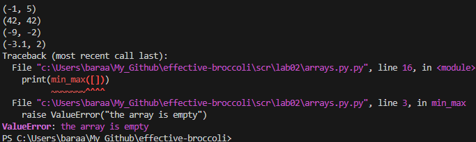
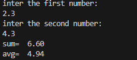
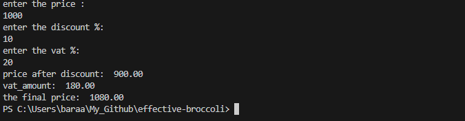
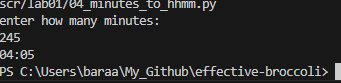
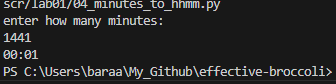
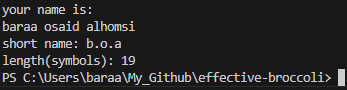
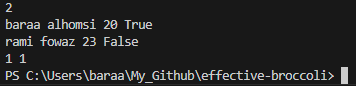

# effective-broccoli

## Lab1

### ex01

```python
name = input('Имя: ')
age = int(input('Возраст: '))
print(f'Привет, {name}! Через год тебе будет {age+1}.')
```



### ex02

```python
print("inter the first number:")
a=float(input())
print("inter the second number:")
b=float(input())
sum=a+b
avg=(a*b)/2
print("sum= ",f"{sum:.2f}")
print("avg= ",f"{avg:.2f}")
```



### ex03

```python
print("enter the price : ")
price=float(input())
print("enter the discount %: ")
discount=float(input())
print("enter the vat %: ")
vat=float(input())
base=price*(1-discount/100)
vat_amount=base*(vat/100)
total=base+vat_amount
print("price after discount: ",f"{base:.2f}")
print("vat_amount: ",f"{vat_amount:.2f}")
print("the final price: ",f"{total:.2f}")
```



### ex04

```python
print("enter how many minutes: ")
a=int(input())
b=a//60
c=a%60
if b<=23:
    print(f"{b:02}:{c:02}")
else:
     b=b-24
     print(f"{b:02}:{c:02}")
 ```

   

 ### ex05

 ```python
 print("your name is: ")
name=str(input())
length=len(name)
def first_letters(names):
    nnn=names.split()
    the_basic_part= [n[0] for n in nnn if n]
    return '.'.join(the_basic_part)
print("short name:",first_letters(name))
print("length(symbols):",length)
```



### ex06

```python
n = int(input())
ochno=0
zaochno=0
for _ in range(n):
    surname, name, age, form = input().split()
    if form == "True":
        ochno+=1
    else:
        zaochno+=1
print(ochno, zaochno)
```

