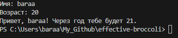
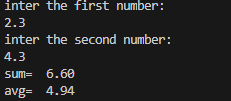
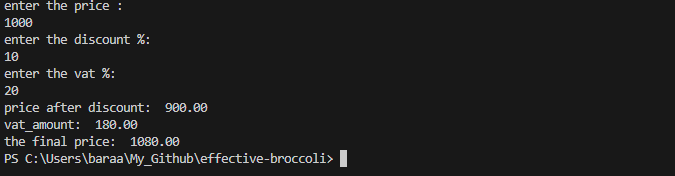
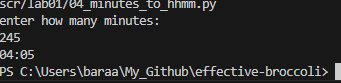
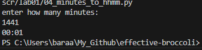
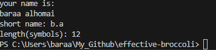
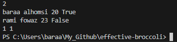
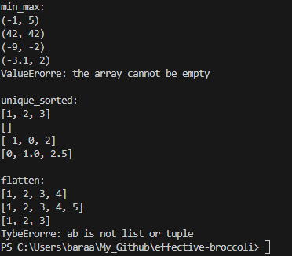
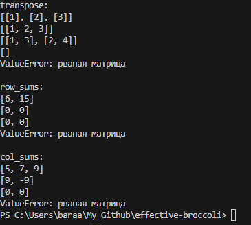
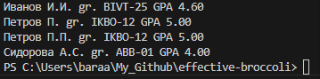

# effective-broccoli

## Lab1

### ex01

```python
name = input('Имя: ')
age = int(input('Возраст: '))
print(f'Привет, {name}! Через год тебе будет {age+1}.')
```



### ex02

```python
print("inter the first number:")
a=float(input())
print("inter the second number:")
b=float(input())
sum=a+b
avg=(a*b)/2
print("sum= ",f"{sum:.2f}")
print("avg= ",f"{avg:.2f}")
```



### ex03

```python
print("enter the price : ")
price=float(input())
print("enter the discount %: ")
discount=float(input())
print("enter the vat %: ")
vat=float(input())
base=price*(1-discount/100)
vat_amount=base*(vat/100)
total=base+vat_amount
print("price after discount: ",f"{base:.2f}")
print("vat_amount: ",f"{vat_amount:.2f}")
print("the final price: ",f"{total:.2f}")
```



### ex04

```python
print("enter how many minutes: ")
a=int(input())
b=a//60
c=a%60
if b<=23:
    print(f"{b:02}:{c:02}")
else:
     b=b-24
     print(f"{b:02}:{c:02}")
 ```

   

 ### ex05

 ```python
print("your name is: ")
name=str(input())
def first_letters(names):
    nnn=name.split()
    the_basic_part= [n[0] for n in nnn if n]
    return '.'.join(the_basic_part)
length=len(name.replace(" ", ""))
print("short name:",first_letters(name))
print("length(symbols):",length)
```



### ex06

```python
n = int(input())
ochno=0
zaochno=0
for _ in range(n):
    surname, name, age, form = input().split()
    if form == "True":
        ochno+=1
    else:
        zaochno+=1
print(ochno, zaochno)
```



## Lab2

### array

```python
def min_max(nums: list[float | int]) -> tuple[float | int, float | int]:
    if not nums:
        raise ValueError("the array cannot be empty")
    min_val = nums[0]
    max_val = nums[0]
    for num in nums:
        if num < min_val:
            min_val = num
        if num > max_val:
            max_val = num
    return (min_val, max_val)
print("min_max: ")
print(min_max([3, -1, 5, 5, 0]))
print(min_max([42]))
print(min_max([-5, -2, -9]))
print(min_max([1.5, 2, 2.0, -3.1]))
try:
    print(min_max([]))
except Exception as e:
    print(f"ValueErorre: {e}\n")

def unique_sorted(nums: list[float | int]) -> list[float | int]:
    unique_nums = list(set(nums))
    unique_nums.sort()
    return unique_nums

print("unique_sorted: ")
print(unique_sorted([3, 1, 2, 1, 3]))
print(unique_sorted([]))
print(unique_sorted([-1, -1, 0, 2, 2]))
print(unique_sorted([1.0, 1, 2.5, 2.5, 0]),"\n")

def flatten(mat: list[list | tuple]) -> list:
    result = []
    for item in mat:
        if not isinstance(item, (list, tuple)):
            raise TypeError("ab is not list or tuple")
        for element in item:
            if isinstance(element, (list, tuple)):
                result.extend(flatten([element]))
            else:
                result.append(element)
    return result

print("flatten: ")
print(flatten([[1, 2], [3, 4]]))
print(flatten([([1, 2], (3, 4, 5))]))
print(flatten([[1], [], [2, 3]]))
try:
    print(flatten([[1, 2], "ab"]))
except Exception as e:
    print(f"TybeErorre: {e}")
```



### matrix

```python
def transpose(mat: list[list[float | int]]) -> list[list]:
    if not mat:
        return []
    cols=len(mat[0])
    rows=len(mat)
    transpose=[]
    for i, row in enumerate(mat):
        if len(row) != cols:
            raise ValueError("рваная матрица")
    for col_index in range(cols):
        new_row=[]
        for row_index in range(rows):
            new_row.append(mat[row_index][col_index])
        transpose.append(new_row)
    return transpose

print("transpose: ")
print(transpose([[1, 2, 3]]))
print(transpose([[1], [2], [3]]))
print(transpose([[1, 2], [3, 4]]))
print(transpose([[]]))
try:
    print(transpose([[1, 2], [3]]))
except Exception as e:
    print(f"ValueError: {e}","\n")

def row_sums(mat: list[list[float | int]]) -> list[float]:
    cols=len(mat[0])
    rows=len(mat)
    new_mat=[]
    for i, row in enumerate(mat):
        if len(row) != cols:
            raise ValueError("рваная матрица")
    for num_row in range (rows):
        row_sum=0
        for num_col in range (cols):
            row_sum+=mat[num_row][num_col]
        new_mat.append(row_sum)
    return new_mat

print("row_sums: ")
print(row_sums([[1, 2, 3], [4, 5, 6]]))
print(row_sums([[-1, 1], [10, -10]]))
print(row_sums([[0, 0], [0, 0]]))
try:
    print(row_sums([[1, 2], [3]]))
except Exception as e:
    print(f"ValueError: {e}","\n")

def col_sums(mat: list[list[float | int]]) -> list[float]:
    cols=len(mat[0])
    rows=len(mat)
    new_mat=[]
    for i, row in enumerate(mat):
        if len(row) != cols:
            raise ValueError("рваная матрица")
    for num_col in range (cols):
        col_sum=0
        for num_row in range (rows):
            col_sum+=mat[num_row][num_col]
        new_mat.append(col_sum)
    return new_mat

print("col_sums: ")
print(col_sums([[1, 2, 3], [4, 5, 6]]))
print(col_sums([[-1, 1], [10, -10]]))
print(col_sums([[0, 0], [0, 0]]))
try:
    print(col_sums([[1, 2], [3]]) )
except Exception as e:
    print(f"ValueError: {e}")
```



### tuples

```python
def format_record(record):
    if type(record) != tuple:
        raise TypeError("Input must be a tuple")
    if len(record) != 3:
        raise ValueError("Tuple must have exactly 3 elements")
    full_name, group, gpa = record
    if type(full_name) != str:
        raise TypeError("ФИО must be a string")
    if type(group) != str:
        raise TypeError("Group must be a string")
    if type(gpa) not in (int, float):
        raise TypeError("GPA must be a number")
    full_name = full_name.strip()
    if not full_name:
        raise ValueError("ФИО cannot be empty")
    group = group.strip()
    if not group:
        raise ValueError("Group cannot be empty")
    if gpa < 0:
        raise ValueError("GPA cannot be negative")
    name_parts = [part.strip() for part in full_name.split() if part.strip()]
    if len(name_parts) < 2:
        raise ValueError("ФИО must contain at least last name and first name")
    last_name = name_parts[0]
    first_names = name_parts[1:]
    initials = '.'.join(name[0].upper() for name in first_names) + '.'
    formatted_gpa = f"{gpa:.2f}"
    formatted_result = f"{last_name} {initials}, гр. {group}, GPA {formatted_gpa}"
    return formatted_result
print("=== format_record ===")   
print(format_record(("Иванов Иван Иванович", "БИВТ-25", 4.6)))  
print(format_record(("Петров Пётр", "IKB0-12", 5.0)))  
print(format_record(("Петров Пётр Петрович", "IKB0-12", 5.0)))
print(format_record(("Сидорова анна аергеевна", "АВВ-01", 3.999)))
```



## Lab04

### Файлы: TXT/CSV и отчёты по текстовой статистике

### Структура проекта
```
python_labs/
 ├──src/
 │├── lib/
 ││   └── text.py
 │└── lab04/
 │├── io_txt_csv.py
 │└── text_report_advanced.py
 ├──data/
 │├── lab04/
 │├── input.txt
 │├── a.txt
 │└── b.txt
 ```

 ### Задание A — модуль src/lab04/io_txt_csv.py

 ```python
 from pathlib import Path
import csv
from typing import Union, Tuple, List


def read_text_file(path: Union[str, Path], encoding: str = "utf-8") -> str:

    file_path = Path(path)
    
    with open(file_path, 'r', encoding=encoding) as f:
        return f.read()


def save_to_csv(data: List[Union[tuple, list]], path: Union[str, Path], 
                header: Tuple[str, ...] = None) -> None:

    file_path = Path(path)
    make_parent_dir(file_path)
    
    if data:
        expected_len = len(data[0])
        for i, row in enumerate(data):
            if len(row) != expected_len:
                raise ValueError(f"Row {i} has length {len(row)}, expected {expected_len}")
    
    with open(file_path, 'w', newline='', encoding='utf-8') as f:
        writer = csv.writer(f, delimiter=',')
        
        if header:
            writer.writerow(header)
        
        writer.writerows(data)


def make_parent_dir(path: Union[str, Path]) -> None:

    dir_path = Path(path).parent
    dir_path.mkdir(parents=True, exist_ok=True)


if __name__ == "__main__":
    try:
        text = read_text_file("data/lab04/input.txt")
        print(f"File content: '{text}'")
        print(f"Content length: {len(text)}")
    except Exception as e:
        print(f"[Error reading text file] {e}")

    try:
        save_to_csv([("word", "count"), ("test", 3)], "data/lab04/check.csv")
        print("CSV file 'check.csv' created successfully.")
    except Exception as e:
        print(f"[Error writing CSV] {e}")
```

  

  

### Задание B — скрипт src/lab04/text_report_advanced.py

```python
import sys
import argparse
from pathlib import Path
from typing import List, Dict, Tuple

from io_txt_csv import read_text_file, save_to_csv
from scr.lib.text import normalize, tokenize, count_freq, top_n

# === Processing functions ===

def process_text(text: str) -> Dict[str, int]:
    normalized = normalize(text)
    tokens = tokenize(normalized)
    return count_freq(tokens)


def print_summary(word_freq: Dict[str, int], total_words: int):
    unique_words = len(word_freq)
    top_words = top_n(word_freq, 5)

    print(f"Total words: {total_words}")
    print(f"Unique words: {unique_words}")
    print("Top 5 most frequent words:")
    for word, count in top_words:
        print(f"{word}: {count}")


def print_pretty_table(word_freq: Dict[str, int]):
    if not word_freq:
        print("No data to display.")
        return

    sorted_words = top_n(word_freq, len(word_freq))
    max_word_len = max(len(word) for word in word_freq.keys())
    max_count_len = max(len(str(count)) for count in word_freq.values())

    word_col = max(max_word_len, len("Word"))
    count_col = max(max_count_len, len("Count"))

    print("\n" + "=" * (word_col + count_col + 5))
    print(f"{'Word':<{word_col}} | {'Count':>{count_col}}")
    print("=" * (word_col + count_col + 5))

    for word, count in sorted_words:
        print(f"{word:<{word_col}} | {count:>{count_col}}")

    print("=" * (word_col + count_col + 5))


def main_single(input_file: str, output_file: str, encoding: str = "utf-8"):

    try:
        text = read_text_file(input_file, encoding)
        word_freq = process_text(text)
        total_words = sum(word_freq.values())

        sorted_words = top_n(word_freq, len(word_freq))
        rows = [(word, str(count)) for word, count in sorted_words]
        save_to_csv(rows, output_file, header=("word", "count"))

        print_summary(word_freq, total_words)
        print_pretty_table(word_freq)
        print(f"\nReport saved to: {output_file}")

    except FileNotFoundError:
        print(f"Error: File '{input_file}' not found.")
        sys.exit(1)
    except UnicodeDecodeError:
        print(f"Error: Invalid file encoding. Try using --encoding cp1251.")
        sys.exit(1)


def main_multiple(input_files: List[str], per_file_output: str, total_output: str, encoding: str = "utf-8"):
    """Processes multiple files and generates both per-file and total reports."""
    all_freq: Dict[str, int] = {}
    per_file_data = []

    for file in input_files:
        try:
            text = read_text_file(file, encoding)
            word_freq = process_text(text)

            for word, count in word_freq.items():
                all_freq[word] = all_freq.get(word, 0) + count
                per_file_data.append((Path(file).name, word, str(count)))

        except FileNotFoundError:
            print(f"Error: File '{file}' not found.")
            sys.exit(1)
        except UnicodeDecodeError:
            print(f"Error: Invalid encoding in file '{file}'. Try using --encoding cp1251.")
            sys.exit(1)

    per_file_data.sort(key=lambda x: (x[0], -int(x[2]), x[1]))
    save_to_csv(per_file_data, per_file_output, header=("file", "word", "count"))

    sorted_total = top_n(all_freq, len(all_freq))
    total_rows = [(word, str(count)) for word, count in sorted_total]
    save_to_csv(total_rows, total_output, header=("word", "count"))

    total_words = sum(all_freq.values())
    print_summary(all_freq, total_words)
    print_pretty_table(all_freq)

    print(f"\nPer-file report saved to: {per_file_output}")
    print(f"Total summary report saved to: {total_output}")

def main():
    parser = argparse.ArgumentParser(description='Word frequency report generator.')
    parser.add_argument('--in', dest='input_files', nargs='+',
                        default=['data/lab04/input.txt'],
                        help='Input file(s). Default: data/lab04/input.txt')
    parser.add_argument('--out', dest='output_file',
                        default='data/lab04/report.csv',
                        help='Output CSV file for single-file mode.')
    parser.add_argument('--per-file', dest='per_file_output',
                        help='Output CSV file for per-file report.')
    parser.add_argument('--total', dest='total_output',
                        help='Output CSV file for total report.')
    parser.add_argument('--encoding', default='utf-8',
                        help='File encoding. Default: utf-8.')

    args = parser.parse_args()

    if len(args.input_files) == 1 and not args.per_file_output and not args.total_output:
        main_single(args.input_files[0], args.output_file, args.encoding)
    else:
        per_file = args.per_file_output or 'data/lab04/report_per_file.csv'
        total_file = args.total_output or 'data/lab04/report_total.csv'
        main_multiple(args.input_files, per_file, total_file, args.encoding)


if __name__ == "__main__":
    main()
```
### into the terminal
"python scr/lab04/text_report_advanced.py --in data/lab04/a.txt data/lab04/b.txt --per-file data/lab04/report_per_file.csv --total data/lab04/report_total.csv"

  

  
   

### by click "Run"(works with file input.txt)
