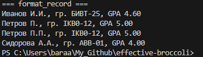

# effective-broccoli

## Lab1

### ex01

```python
name = input('Имя: ')
age = int(input('Возраст: '))
print(f'Привет, {name}! Через год тебе будет {age+1}.')
```


### ex02

```python
print("inter the first number:")
a=float(input())
print("inter the second number:")
b=float(input())
sum=a+b
avg=(a*b)/2
print("sum= ",f"{sum:.2f}")
print("avg= ",f"{avg:.2f}")
```


### ex03

```python
print("enter the price : ")
price=float(input())
print("enter the discount %: ")
discount=float(input())
print("enter the vat %: ")
vat=float(input())
base=price*(1-discount/100)
vat_amount=base*(vat/100)
total=base+vat_amount
print("price after discount: ",f"{base:.2f}")
print("vat_amount: ",f"{vat_amount:.2f}")
print("the final price: ",f"{total:.2f}")
```


### ex04

```python
print("enter how many minutes: ")
a=int(input())
b=a//60
c=a%60
if b<=23:
    print(f"{b:02}:{c:02}")
else:
     b=b-24
     print(f"{b:02}:{c:02}")
 ```

   

 ### ex05

 ```python
print("your name is: ")
name=str(input())
def first_letters(names):
    nnn=name.split()
    the_basic_part= [n[0] for n in nnn if n]
    return '.'.join(the_basic_part)
length=len(name.replace(" ", ""))
print("short name:",first_letters(name))
print("length(symbols):",length)
```


### ex06

```python
n = int(input())
ochno=0
zaochno=0
for _ in range(n):
    surname, name, age, form = input().split()
    if form == "True":
        ochno+=1
    else:
        zaochno+=1
print(ochno, zaochno)
```


## Lab2

### array

```python
def min_max(nums: list[float | int]) -> tuple[float | int, float | int]:
    if not nums:
        raise ValueError("the array cannot be empty")
    min_val = nums[0]
    max_val = nums[0]
    for num in nums:
        if num < min_val:
            min_val = num
        if num > max_val:
            max_val = num
    return (min_val, max_val)
print("min_max: ")
print(min_max([3, -1, 5, 5, 0]))
print(min_max([42]))
print(min_max([-5, -2, -9]))
print(min_max([1.5, 2, 2.0, -3.1]))
try:
    print(min_max([]))
except Exception as e:
    print(f"ValueErorre: {e}\n")

def unique_sorted(nums: list[float | int]) -> list[float | int]:
    unique_nums = list(set(nums))
    unique_nums.sort()
    return unique_nums

print("unique_sorted: ")
print(unique_sorted([3, 1, 2, 1, 3]))
print(unique_sorted([]))
print(unique_sorted([-1, -1, 0, 2, 2]))
print(unique_sorted([1.0, 1, 2.5, 2.5, 0]),"\n")

def flatten(mat: list[list | tuple]) -> list:
    result = []
    for item in mat:
        if not isinstance(item, (list, tuple)):
            raise TypeError("ab is not list or tuple")
        for element in item:
            if isinstance(element, (list, tuple)):
                result.extend(flatten([element]))
            else:
                result.append(element)
    return result

print("flatten: ")
print(flatten([[1, 2], [3, 4]]))
print(flatten([([1, 2], (3, 4, 5))]))
print(flatten([[1], [], [2, 3]]))
try:
    print(flatten([[1, 2], "ab"]))
except Exception as e:
    print(f"TybeErorre: {e}")
```


## matrix

```python
def transpose(mat: list[list[float | int]]) -> list[list]:
    if not mat:
        return []
    cols=len(mat[0])
    rows=len(mat)
    transpose=[]
    for i, row in enumerate(mat):
        if len(row) != cols:
            raise ValueError("рваная матрица")
    for col_index in range(cols):
        new_row=[]
        for row_index in range(rows):
            new_row.append(mat[row_index][col_index])
        transpose.append(new_row)
    return transpose

print("transpose: ")
print(transpose([[1, 2, 3]]))
print(transpose([[1], [2], [3]]))
print(transpose([[1, 2], [3, 4]]))
print(transpose([[]]))
try:
    print(transpose([[1, 2], [3]]))
except Exception as e:
    print(f"ValueError: {e}","\n")

def row_sums(mat: list[list[float | int]]) -> list[float]:
    cols=len(mat[0])
    rows=len(mat)
    new_mat=[]
    for i, row in enumerate(mat):
        if len(row) != cols:
            raise ValueError("рваная матрица")
    for num_row in range (rows):
        row_sum=0
        for num_col in range (cols):
            row_sum+=mat[num_row][num_col]
        new_mat.append(row_sum)
    return new_mat

print("row_sums: ")
print(row_sums([[1, 2, 3], [4, 5, 6]]))
print(row_sums([[-1, 1], [10, -10]]))
print(row_sums([[0, 0], [0, 0]]))
try:
    print(row_sums([[1, 2], [3]]))
except Exception as e:
    print(f"ValueError: {e}","\n")

def col_sums(mat: list[list[float | int]]) -> list[float]:
    cols=len(mat[0])
    rows=len(mat)
    new_mat=[]
    for i, row in enumerate(mat):
        if len(row) != cols:
            raise ValueError("рваная матрица")
    for num_col in range (cols):
        col_sum=0
        for num_row in range (rows):
            col_sum+=mat[num_row][num_col]
        new_mat.append(col_sum)
    return new_mat

print("col_sums: ")
print(col_sums([[1, 2, 3], [4, 5, 6]]))
print(col_sums([[-1, 1], [10, -10]]))
print(col_sums([[0, 0], [0, 0]]))
try:
    print(col_sums([[1, 2], [3]]) )
except Exception as e:
    print(f"ValueError: {e}")
```


## tuples

```python
def format_record(fio: str,group: str,gpa: float) -> str:
    if not fio or not group:
        raise ValueError("you have to enter the name")
    if not isinstance(gpa, (float, int)):
        raise TypeError("type GPA shoud not be str")
    sfio=fio.split()
    sfio_len=len(sfio)
    f=sfio[0].capitalize()+" " if sfio_len >= 1 else ""
    i=sfio[1][0].capitalize()+"." if sfio_len >= 2 else ""
    o=sfio[2][0].capitalize()+"." if sfio_len >= 3 else ""
    x=f+i+o
    y=f"gr. {group}"
    z=f"GPA {gpa:.2f}"
    s= x + " " + y + " " + z
    return s
print(format_record("Иванов Иван Иванович", "BIVT-25", 4.6))
print(format_record("Петров Пётр", "IKBO-12", 5.0))
print(format_record("Петров Пётр Петрович", "IKBO-12", 5.0))
print(format_record("  сидорова  анна   сергеевна ", "ABB-01", 3.999))
```

